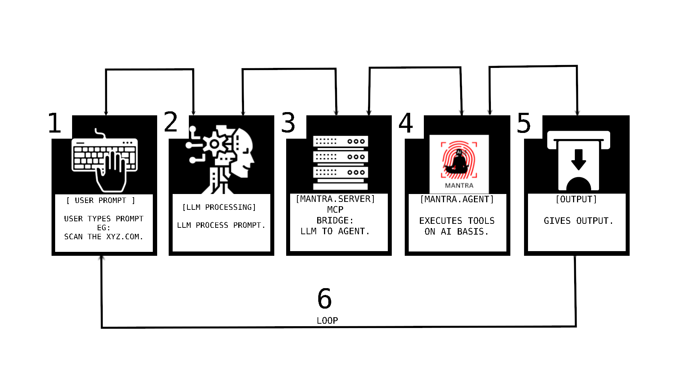
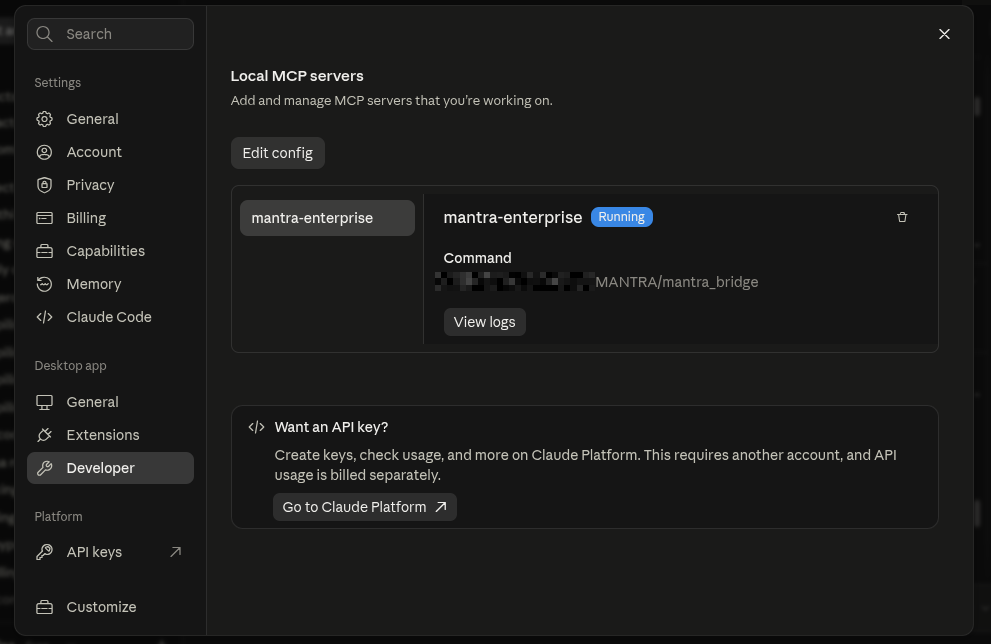
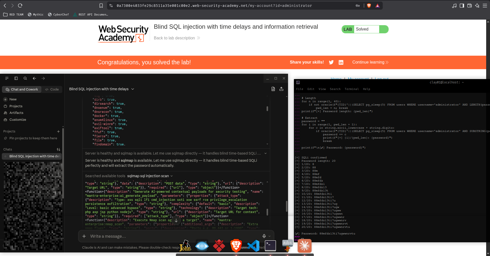

<p align="center">
  
</p>

<h1 align="center">🧘 MANTRA</h1>

<p align="center">
  <b>MCP server bridging AI agents to 100+ security tools</b><br>
  Pentesting · Red Teaming · Bug Bounty · CTF · Security Research
</p>

<p align="center">
  
  
  
  
  
</p>

---

## 🛠 How MANTRA Works

MANTRA is three layers: **brain**, **translator**, **executor**.

**LLM (Brain)** receives your goal in plain English. It breaks the goal into steps, picks which security tool to run, and generates the right arguments. After each tool runs, LLM reads the output, reasons over results, and decides the next action. It chains tools together — recon feeds into scanning, scanning feeds into exploitation.

**Bridge (Translator)** sits between LLM and the server. LLM speaks MCP protocol over stdin/stdout. Server speaks HTTP. Bridge converts one to the other. No logic, no decisions — pure format conversion.

**Server (Executor)** receives HTTP requests, builds shell commands, runs tools via `popen()`, captures stdout, and returns JSON. It knows 100+ security tools — nmap, nuclei, sqlmap, hydra, metasploit, gobuster, subfinder, and more. It doesn't think. It executes what it's told and returns raw output.


<p align="center">
  
</p>


> **The loop:** You give a goal → LLM picks a tool → bridge forwards → server executes → output returns → LLM analyzes → picks next tool → repeats until goal is met.

MANTRA doesn't replace security tools. It wraps them so AI can use them **autonomously** — chaining subfinder → httpx → nuclei without you typing a single command.

---

## ⚡ Prerequisites

Install Dependices and packages :

```bash
chmod +x install.sh && ./install.sh
```

---

## 🔨 Build

Linux & MacOS
```bash
# Build server
g++ -std=c++17 -pthread main.cpp -lcurl -o mantra

# Build MCP bridge
g++ -std=c++17 mantra_mcp.cpp -lcurl -o mantra_bridge
```

Windows
```bash
# Build server
g++ -std=c++17 -pthread main.cpp -lcurl -o mantra.exe

# Build MCP bridge
g++ -std=c++17 mantra_mcp.cpp -lcurl -o mantra_bridge.exe
```


---

## 🚀 How to Use

### 1. Start Server

```bash
# Default (localhost:8888)
./mantra

# Custom port
./mantra 9999

# With API key authentication (recommended)
MANTRA_API_KEY=your-secret-key ./mantra
```

### 2. Connect to LLM Desktop

Add to your LLM Desktop config:

| OS | Config Path |
|----|------------|
| Linux | `~/.config/{LLM}/LLM_desktop_config.json` |
| macOS | `~/Library/Application Support/{LLM}/LLM_desktop_config.json` |
| Windows | `%APPDATA%\{LLM}\LLM_desktop_config.json` |

```json
{
  "mcpServers": {
    "mantra-enterprise": {
      "command": "/path/to/mantra_bridge",
      "args": [],
      "timeout": 300
    }
  }
}
```

### 3. Restart LLM Desktop

Close and reopen. Tools icon appears with 100+ security tools.

### 4. Talk to LLM

Describe what you want in plain English:

```
"Scan example.com with nmap"
"Find subdomains for target.com using subfinder then probe with httpx"
"Run nuclei against https://target.com with critical,high severity"
"Brute force SSH on 10.10.10.1 with hydra using rockyou.txt"
"Analyze this binary with checksec and strings"
"Full recon on example.com — subdomains, live hosts, tech stack, vulns"
```

LLM picks the right tools, chains them, and reports findings.

### 5. Other MCP Clients

Works with any MCP-compatible AI — Cursor, Windsurf, Copilot, Cline, Aider. Same setup: point MCP config at `mantra_bridge` binary.

### 6. Direct API (Without AI)

```bash
# Health check
curl http://127.0.0.1:8888/health

# Nmap scan
curl -X POST http://127.0.0.1:8888/api/tools/nmap \
  -H "Content-Type: application/json" \
  -d '{"target":"scanme.nmap.org","scan_type":"-sV"}'

# Subfinder
curl -X POST http://127.0.0.1:8888/api/tools/subfinder \
  -H "Content-Type: application/json" \
  -d '{"target":"example.com"}'

# All endpoints
curl http://127.0.0.1:8888/help
```

---

## 🛠️ Features

| Feature | Description |
|---------|-------------|
| MCP Protocol | JSON-RPC bridge connects any MCP-compatible AI agent |
| 100+ Security Tools | Nmap, nuclei, sqlmap, hydra, metasploit, and more |
| AI Agent Loop | Agent plans, executes, analyzes output, decides next step autonomously |
| Dynamic Tool Detection | Auto-scans system for installed tools at startup |
| Multi-Platform | LLM Desktop, Cursor, Windsurf, Copilot, Cline, Aider |
| Smart Scan Engine | AI-driven target analysis, tool selection, parameter optimization |
| Attack Chaining | Auto-chains recon → scan → exploit based on results |
| CVE Intelligence | Live CVE monitoring, exploit generation from advisories |
| Bug Bounty Workflows | Pre-built recon, vuln hunting, auth bypass, file upload flows |
| Payload Generation | Buffer, cyclic, random payloads + AI-generated attack suites |
| Process Management | Launch, pause, resume, terminate long-running tools |
| Result Caching | Cache tool output, skip repeated scans |
| Error Recovery | Auto-retry failed tools, suggest alternatives |
| API Security Suite | GraphQL, JWT, REST fuzzing, schema analysis |
| Cloud/Container | AWS, GCP, Azure, K8s, Docker security audits |
| Binary/PWN/CTF | GDB, Ghidra, ROP gadgets, symbolic execution |
| Forensics/Stego | Memory analysis, file carving, steganography |

---

## 🔧 Supported Tools

| Category | Tools |
|----------|-------|
| Network Scanning | nmap, masscan, rustscan, arp-scan, nbtscan, autorecon |
| Web Scanning | nuclei, nikto, gobuster, dirb, ffuf, feroxbuster, dirsearch, wfuzz |
| XSS/Injection | dalfox, xsser, sqlmap, dotdotpwn |
| Recon/OSINT | amass, subfinder, katana, gau, waybackurls, httpx, hakrawler |
| Parameter Discovery | arjun, paramspider, x8, qsreplace, uro |
| DNS | fierce, dnsenum, dnsrecon, dig, whois |
| SMB/AD | enum4linux, smbmap, rpcclient, netexec, responder |
| Credential Attack | hydra, john, hashcat, hashpump |
| Exploitation | metasploit, msfvenom, searchsploit |
| Binary Analysis | gdb, radare2, ghidra, binwalk, checksec, objdump, strings |
| PWN/CTF | ropgadget, ropper, one_gadget, pwntools, angr |
| Forensics/Stego | volatility, foremost, steghide, exiftool |
| Cloud Security | prowler, trivy, scout-suite, kube-hunter, falco, checkov |
| API Security | graphql_scanner, jwt_analyzer, api_fuzzer |
| WAF/Fingerprint | wafw00f, whatweb, jaeles |

---

## Screenshots
<p align="center">
  
</p>

<p align="center">
  
</p>

## 📕 References   

https://www.praetorian.com/blog/mcp-server-security-the-hidden-ai-attack-surface/
https://medium.com/seercurity-spotlight/offensive-mcp-and-mcp-for-offensive-1ac7ffe82fb6

## 🌟 CREDITS

https://github.com/0x4m4/hexstrike-ai 


## ⚠️ Security Concerns 


<div align="center">


</div>

<div style="background: linear-gradient(90deg, #ff9a9e 0%, #fecfef 50%, #fecfef 100%); 
            padding: 15px; border-radius: 12px; border-left: 5px solid #ff4757;">

<p align="center"> 
<b>MANTRA</b> is a Model Context Protocol (MCP)-based agent framework and security suite designed to assist with cybersecurity research, authorized penetration testing, CTF competitions, defensive technology research, and educational training.
</p>

</div>
